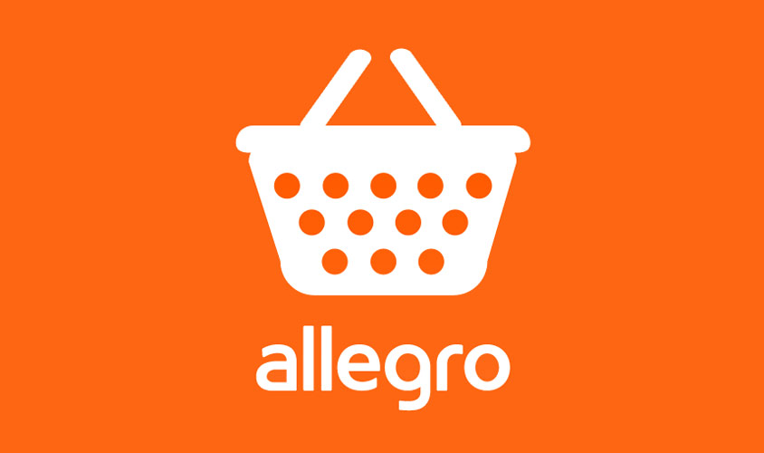
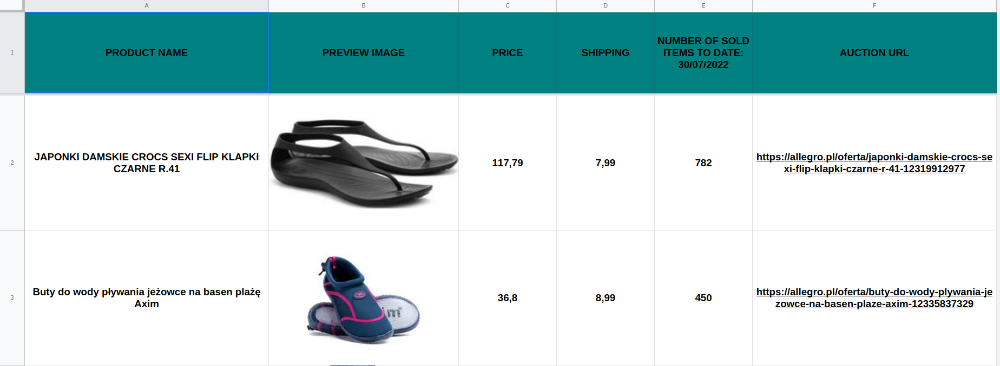

# Allegro Best Selling Items



allegro.pl scraper based on selenium framework that scrapes auctions from 
given category, saves output as json and creates report of best-selling items
in Google Sheets. Use responsibly.

## Table of contents
- [Prerequisites](#prerequisites)
  - [Chrome browser version](#chrome-browser-version)
- [Installation](#installation)
- [Usage](#usage)
  - [Quickstart](#quickstart)
  - [Category scraper](#category-scraper)
  - [Google sheet report creator](#google-sheet-report-creator)
- [Contributing](#contributing)
- [License](#license)
- [Code of Conduct](#code-of-conduct)

## Prerequisites
In order to use Google Sheets to create reports from scraper
you have to obtain json key credentials file.

Follow the steps:

1. Create spreadsheet: [here](https://youtu.be/wrR0YLzh4DQ?t=44).
2. Enable Google Drive & Sheets API: [here](https://youtu.be/wrR0YLzh4DQ?t=85).
3. Creating a Service Account: [here](https://youtu.be/wrR0YLzh4DQ?t=186).
4. Save obtained json file inside of project root directory.

### Chrome browser version
Recommended version of Chrome browser and Chrome driver is: 102.0.5005.61
at the time of release the script, selenium does not work well with Chrome version 103
issues were fixed in version 104 and once that version will be released as stable
it is possible to use it after changing "chrome_driver_version" variable inside of config.py file.
Remember that chrome driver version must be the same as Chrome browser version installed on your system.

## Installation

Use git clone to get the script:

```shell
git clone https://github.com/michalkulisiewicz/allegro_best_selling_items.git
```

Install all requirements using pip:

```shell
pip install -r requirements.txt
```


## Usage

### Quickstart

```python
from allegro_best_selling_items.google_sheet import GoogleSheet
from allegro_best_selling_items.allegro_category_scraper import AllegroCategoryScraper
from allegro_best_selling_items.utils import read_auctions_from_json


def run_category_scraper(category_url, num_of_pages=1):
    """
    Scrapes auctions from given category, extracts fields including: price, number of sold items, shipping_price
    saves output as json file in category_scraper output directory
    :param category_url: url of category being scraped (str)
    :param num_of_pages: number of pages to scrape, default is 1 (int)
    """
    category_scraper = AllegroCategoryScraper()
    category_scraper.run_cat_scraper(category_url, num_of_pages)


def add_category_scraper_output_to_google_sheet(secret_filename, output_workbook_name):
    """
    Creates worksheet for every json file inside of category_scraper_output directory
    :param secret_filename: file name of json credentials file needed to work with Google Sheets (str)
    :param output_workbook_name: name of workbook in Google Sheets created by the user (str)
    """
    auction_scraper_output = read_auctions_from_json('category_scraper_output')
    google_sheet = GoogleSheet(secret_filename, output_workbook_name)
    google_sheet.add_items_to_worksheet(auction_scraper_output)


if __name__ == '__main__':
    # Scrapes auctions from given category, saves output as json file in category_scraper_output directory
    run_category_scraper('https://allegro.pl/kategoria/obuwie-damskie-531', 10)
    # Creates report in Google Sheets based on the json file in auction_scraper_output directory
    add_category_scraper_output_to_google_sheet('SECRET_FILENAME', 'GOOGLE_SHEET_WORKBOOK_NAME')


```

### Category scraper

Creates json file where filename is "id" of category that was scraped

```python
from allegro_best_selling_items.allegro_category_scraper import AllegroCategoryScraper

category_scraper = AllegroCategoryScraper()
category_scraper.run_cat_scraper('https://allegro.pl/kategoria/obuwie-damskie-531', 1)
```


**Output file structure**
```json
[
    {
        "product_url": "https://allegro.pl/oferta/czarno-zlote-sneakersy-buty-adidasy-damskie-12443956473",
        "product_name": "Czarno-Złote Sneakersy Buty Adidasy Damskie",
        "product_price": 55.0,
        "shipping_price": 7.99,
        "number_of_sold_items": 20,
        "product_image_url": "https://a.allegroimg.com/s180/113e2d/3bd0c7e7406399857cf7eb14923f/Czarno-Zlote-Sneakersy-Buty-Adidasy-Damskie"
    },
    {
        "product_url": "https://allegro.pl/oferta/biale-trampki-tenisowki-balerinki-wiazane-10788157930",
        "product_name": "BIAŁE TRAMPKI TENISÓWKI BALERINKI WIĄZANE",
        "product_price": 16.9,
        "shipping_price": 7.99,
        "number_of_sold_items": 423,
        "product_image_url": "https://a.allegroimg.com/s180/11e9cc/19a424c743ecaecab8e87046c92b/BIALE-TRAMPKI-TENISOWKI-BALERINKI-WIAZANE"
    },
    {
        "product_url": "https://allegro.pl/oferta/granatowe-damskie-sandalki-na-slupku-lexyra-39-12274614706",
        "product_name": "GRANATOWE DAMSKIE SANDAŁKI NA SŁUPKU LEXYRA 39",
        "product_price": 64.99,
        "shipping_price": 8.99,
        "number_of_sold_items": 63,
        "product_image_url": "https://a.allegroimg.com/s180/11c14c/401a13414334ba00999ca77d5a1d/GRANATOWE-DAMSKIE-SANDALKI-NA-SLUPKU-LEXYRA-39"
    }
]
```

### Google sheet report creator
Create reports for every json file inside of category_scraper_output directory:

```python
from allegro_best_selling_items.google_sheet import GoogleSheet
from allegro_best_selling_items.utils import read_auctions_from_json

auction_scraper_output = read_auctions_from_json('category_scraper_output')
google_sheet = GoogleSheet('SECRET_FILENAME', 'GOOGLE_SHEET_WORKBOOK_NAME')
google_sheet.add_items_to_worksheet(auction_scraper_output)
```
**Output:**



## Contributing

Bug reports and pull requests are welcome on GitHub at
https://github.com/michalkulisiewicz/allegro_best_selling_items. This project is intended to be a safe, welcoming space for collaboration, and contributors are expected to adhere to the [code of conduct](https://github.com/michalkulisiewicz/python-baselinker/blob/master/CODE_OF_CONDUCT.md).

## License

Project is available as open source under the terms of the [MIT License](https://opensource.org/licenses/MIT).

## Code of Conduct

Everyone that interacts in the project codebase, issue trackers, chat rooms and mailing lists is expected to follow the [code of conduct](https://github.com/michalkulisiewicz/allegro_best_selling_items/blob/master/CODE_OF_CONDUCT.md)
